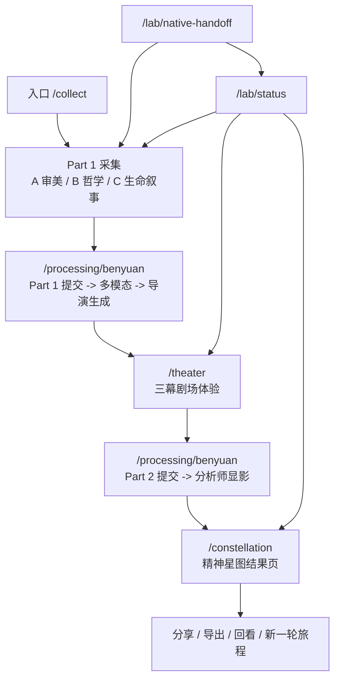

# 本源 UI 架构、页面逻辑与文案包装总览

更新时间：2026-03-15
适用版本：`beta-2026-03-11-r2` 之后的当前 beta
文档目的：给后续整体 UI 调整、文案重写、iOS app 化收口提供一份完整的单一参考，不只看视觉，还把页面板块、状态流转、文案语气、可改动抓手一起梳理清楚。

---

## 0. 当前产品结论

### 0.1 当前主架构

当前不是“原生页面栈 app”，而是：

- **Web 主流程**：`/collect -> /processing/benyuan -> /theater -> /constellation`
- **iOS 壳层**：`WKWebView shell`
- **Native 负责**：壳、桥接、相册/拍照、分享、外部打开、路由恢复
- **Web 负责**：页面、流程、状态、分析链路、结果呈现

这是当前的**既定架构选择**，不是临时凑合。后续做“更像 iOS app”的工作，重点是：

- 去网页感
- 壳层承接
- 页面触感统一
- 视觉系统统一

而不是现在就把三大主页面重写成 SwiftUI 原生页面。

### 0.2 当前主目标

当前阶段最重要的不是继续扩功能，而是：

1. 把现有主链路维持在稳定完成态
2. 让 `/collect`、`/processing`、`/theater`、`/constellation` 的体验更顺
3. 让 iPhone shell 主观感受更像 app
4. 为后续整套 UI 统一优化准备清楚的页面逻辑与文案地图

### 0.3 当前不能动的稳定边界

后续 UI 优化默认不要碰这些边界：

- 公共 API 路由与返回结构
- benchmark JSON wire shape
- storage keys / pending/session keys
- native bridge message 名称：`share`、`openExternal`、`pickImages`
- Part 1 / Part 2 / Part 3 主数据 contract
- `Web 主流程 + WKWebView iOS shell` 总架构

---

## 1. 当前页面总流程图

这条主链路现在已经稳定，后续 UI 调整应围绕它做**节奏、层级、触感、文案统一**，而不是打断这条链。

---

## 2. 页面与文件映射

| 页面 | 主要文件 | 页面职责 | 当前状态 |
| --- | --- | --- | --- |
| `/collect` | `src/app/collect/page.tsx` + `src/components/benyuan-part1-workflow.tsx` | Part 1 总入口，承载 A/B/C 三组采集、测试包、上传、演示入口、分析入口 | 已完成第一轮收口，本轮补了模块自动承接 |
| `/collect/a` `/collect/b` `/collect/c` | `src/app/collect/a/page.tsx` 等 | 单模块独立查看与调试 | 稳定，用于聚焦单模块，不作为主流程推荐入口 |
| `/processing/benyuan` | `src/app/processing/benyuan/page.tsx` + `src/components/benyuan-processing-ritual.tsx` | 处理中间态，真实显示阶段推进而不是假 loading | 稳定 |
| `/theater` | `src/app/theater/page.tsx` + `src/components/benyuan-theater-experience.tsx` | Part 2 剧场体验，记录选择、犹豫、镜像回答 | 稳定 |
| `/constellation` | `src/app/constellation/page.tsx` + `src/components/benyuan-constellation-view.tsx` | Part 3 结果页，呈现原型、七维、张力、建议、推荐、分享导出 | 稳定，仍是后续重点打磨区 |
| `/lab/status` | `src/app/lab/status/page.tsx` | 项目内状态总览，展示 runtime / freeze / benchmark / pilot / iOS readiness | 稳定 |
| `/lab/native-handoff` | `src/app/lab/native-handoff/page.tsx` | iOS shell 与 native handoff 面板，承接真机与壳层验收 | 稳定 |
| 全局壳层 | `src/components/app-shell.tsx` + `src/components/site-header.tsx` | 统一顶部导航与壳层承接 | 本轮补了更像 iOS app 的 shell 顶部导航感 |
| 视觉系统 | `src/config/benyuan-ui-recipes.ts` + `src/components/framework-primitives.tsx` + `src/app/globals.css` | 共享按钮、卡片、面板、状态、safe area、交互规则 | 已形成共享层 |

---

## 3. 共享视觉与交互系统

### 3.1 设计 Token 层

来源：

- `src/app/globals.css`
- `src/config/benyuan-ui-recipes.ts`
- `docs/benyuan-design-tokens-v1.md`

核心原则：

- 黑 / 白 / 灰 / 单一金色强调
- 大留白，高对比
- display 字体偏轻，正文偏克制
- 所有主要操作都应该有明确视觉反馈
- 不靠彩色堆砌层次，而靠：边框、透明度、光晕、间距、顺序

### 3.2 共享 Primitive 层

来源：`src/components/framework-primitives.tsx`

当前已经统一出来的基础件：

- `FrameworkPage`：每页外层骨架
- `GlassPanel`：通用面板
- `ProgressRail`：发丝级进度线
- `SectionTitle`：区块标题结构
- `MetaPill`：元信息胶囊
- `DetailCard`：说明卡片
- `StatCard`：统计卡片
- `PrimaryButton` / `SecondaryButton`

这层是后续统一 UI 的主抓手。后续不要再在页面里散落新的按钮和卡片风格分支，尽量继续收口到这层。

### 3.3 Shell 与去网页感层

来源：

- `src/components/site-header.tsx`
- `src/components/app-shell.tsx`
- `src/app/globals.css`
- `src/lib/benyuan-native-shell.ts`

当前已经存在的 app 化处理：

- safe area 变量
- 去掉默认 tap highlight
- shell 环境下禁用大部分普通文本长按选词
- 非输入区禁默认 touch callout
- `data-benyuan-pressed` 按压反馈
- shell 环境下顶部导航改成更像 app 的分段导航，而不是网站式菜单

本轮新增的壳层收口：

- shell 顶部显示当前所在阶段标题与副文案
- shell 顶部主导航改成 `采集 / 剧场 / 星图 / 状态`
- 顶部信息结构更像 app chrome，而不是网页 header

---

## 4. Part 1 `/collect` 完整拆解

### 4.1 页面定位

`/collect` 是当前整个产品的**主入口页**。

它不是单纯问卷页，而是四层能力叠在一起：

1. 真实采集入口
2. 运行状态面板
3. 测试素材包入口
4. 已跑通 demo 的快速跳转入口

### 4.2 主要文件

- 页面壳：`src/app/collect/page.tsx`
- 主逻辑：`src/components/benyuan-part1-workflow.tsx`
- 数据 schema：`src/lib/benyuan-v3-schema.ts`
- 本地状态：`src/lib/benyuan-v3-client-session.ts`
- 测试包：`src/lib/benyuan-v3-test-packs.ts`
- demo links：`src/lib/benyuan-v3-demo-links.ts` / `src/lib/benyuan-v3-demo-links-server.ts`

### 4.3 页面区块结构

#### A. 页头 Hero

当前包装：

- eyebrow：`Part 1 · 特征数据收集`
- title：`先把审美、哲学与生命叙事，一题一题交给黑暗。`
- description：强调已经收束成单题采集流，A/B/C 三组模块逐题推进

职责：

- 建立 Part 1 仪式感
- 告诉用户：这不是旧版说明页，而是真正采集入口
- 给出两个快捷动作：只看模块 A / 直达演示星图

#### B. 当前态势区

区块文案：

- label：`当前态势`
- title：`采集进度、素材与 runtime 都集中在这里。`

内容：

- 总进度百分比
- A/B/C 三模块状态卡
- 完成度 / 当前模块 / 素材入链 / Runtime 四张统计卡
- 实时状态区：
  - 当前 flow 状态
  - status 文案
  - 下一步
  - 当前焦点问题

职责：

- 把“我现在做到哪了”放在同一屏
- 减少用户切页找状态
- 也服务于调试与 demo 演示

#### C. 测试素材包区

区块文案：

- label：`测试素材包`
- title：`A / B / C 压测素材已经就位。`

内容：

- pack A/B/C 卡片
- 原型名、描述、素材数量
- 一键载入并上传按钮

职责：

- 快速复现整条链路
- 做 benchmark / demo / 回归
- 跳过手工填写成本

#### D. 即时体验区

区块文案：

- label：`即时体验`
- title：`也可以直接进入上一轮真实结果。`

内容：

- A/B/C demo 卡片
- 进入剧场 / 查看星图

职责：

- 不跑 live 的情况下也能演示产品
- 也是 guided pilot 的主要演示入口

#### E. 模块导航区

区块文案：

- label：`Part 1 · 模块`
- title：`三组模块，维持同一条采集链。`

内容：

- A/B/C 模块按钮
- 每组状态：待开始 / 进行中 / 已完成
- 每组进度条与数量

职责：

- 显式告诉用户：A/B/C 是同一条 Part 1 链路，不是三个独立问卷
- 也允许手动切换

#### F. 单题仪式区

主文案：

- title：`先只面对一个问题，再进入下一扇门。`

内容：

- 当前模块说明
- 当前问题序号
- 模块进度 / 总进度
- 当前模块内的题目导航点
- 真正的问题卡片 `QuestionBlock`

职责：

- 把大问卷拆成单题节奏
- 保留仪式感和呼吸感
- 把“选择、上传、填写”统一进一套输入体验

#### G. 底部节奏控制区

这是本轮重点改动区。

当前职责：

- 告诉用户此刻下一步是什么
- 作为主推进按钮区
- 在 iPhone shell 里更像 app 底部操作坞

本轮新增逻辑：

- 模块完成后出现明确承接提示
- `/collect` 总页完成一组后，会自动切到下一组未完成模块
- 底部主按钮不再永远只是“下一题”，而会根据状态变成：
  - `下一题`
  - `进入模块 B / C`
  - `返回总览`
  - `进入剧场`

#### H. 分析入口区

区块文案：

- label：`分析入口`
- title：`完成 Part 1 后，直接进入剧场与分析。`

内容：

- 提交入口按钮
- 当前错误列表
- runtime 摘要与覆盖控制

职责：

- 把 Part 1 结束动作明确收束
- 把“提交后会真实跑什么”解释清楚

### 4.4 当前核心逻辑

#### 本地状态

`/collect` 主要依赖这些本地键：

- `BENYUAN_PART1_STORAGE_KEY`：Part 1 当前答案
- `BENYUAN_RUNTIME_STORAGE_KEY`：runtime override
- `BENYUAN_PART1_STARTED_KEY`：Part 1 起始时间
- `BENYUAN_PENDING_PART1_KEY`：待进入 processing 的 Part 1 负载

#### 模块与题目推进逻辑

当前规则：

- 主流程页 `/collect`：A / B / C 三组在同一条链路里推进
- 单模块页 `/collect/a` `/b` `/c`：只看对应模块，不自动跨模块
- 单选题会自动推进到下一题
- 上传题上传完成后也会自动推进
- **本轮新增**：在 `/collect` 总页里，如果当前模块已完成，系统会自动把用户带到下一组未完成模块
- 如果三组都完成，底部和状态区都会明确告诉用户可以直接进入剧场分析

#### 模块承接规则

- 优先进入当前模块之后的下一组
- 如果用户手动跳着做，且后面没有待完成组，会回到前面未完成组
- 单模块页完成后不跨模块，只引导回总览

这次收口解决的问题：

- 原来做完模块 A 后，用户容易觉得“流程卡住了”
- 现在总页会明确承接，不再把下一步只写成提示文案而不真正切换

### 4.5 当前文案包装风格

Part 1 的文案现在是：

- 仪式感强于效率感
- 解释性文案多于营销性文案
- 用户动作被包装成“进入 / 承接 / 写回 / 显影”而不是“提交 / 下一步 / 完成”

适合保留的包装方向：

- 单题推进的仪式感
- 黑暗、显影、入口、扇门、路径这种隐喻
- “当前态势 / 实时状态 / 当前焦点”这种偏系统控制台的表达

后续可优化点：

- 进一步统一上传题、文字题、选择题的语气
- 减少技术味词汇直接露给用户，例如 `runtime`
- 总页的信息很多，后续还可以再分主次

---

## 5. `/processing/benyuan` 完整拆解

### 5.1 页面定位

`/processing/benyuan` 是两次处理中间态的共用页：

- Part 1 提交后：保存 -> 多模态 -> 导演生成 -> 进入剧场
- Part 2 提交后：保存 -> 分析师显影 -> 进入星图

### 5.2 主要文件

- 页面：`src/app/processing/benyuan/page.tsx`
- 主逻辑：`src/components/benyuan-processing-ritual.tsx`

### 5.3 页面结构

#### A. Hero 区

文案方向：

- `把等待变成一条可被看见的链路显影。`
- 强调这不是假加载，而是“真实串起保存、分析、生成、写回与跳转”

#### B. 链路阶段区

两套阶段定义：

- Part 1 -> Part 2
  - 写入 Part 1
  - 多模态预处理
  - 剧场导演生成
  - 进入剧场
- Part 2 -> Part 3
  - 写入 Part 2
  - 分析师显影
  - 展开星图

#### C. 当前状态区

内容：

- 当前 headline
- 当前 body
- 空态 / 失败态 / 正在运行 / 已准备跳转
- 每阶段 runtime 信息

### 5.4 页面职责

这页最重要的不是好看，而是：

- 准确反映真实阶段
- 允许中断恢复
- 告诉用户卡在哪一层
- 在主观体验上把“等待”改成“显影过程”

### 5.5 文案包装特点

- 偏“过程可视化”
- 技术链路被翻译成“显影、接管、折叠、展开”
- 是整个产品里最适合继续做动效节奏强化的一页

后续优化重点：

- 阶段间的视觉接力
- 成功 / 失败 / 恢复 的语气一致性
- shell 内跳转时的承接感

---

## 6. `/theater` 完整拆解

### 6.1 页面定位

`/theater` 是 Part 2 剧场体验页。

它的目标不是问更多题，而是把 Part 1 的结构化线索折成一段更沉浸、更戏剧化的交互，让用户在做出选择时留下第二层行为数据。

### 6.2 主要文件

- 页面：`src/app/theater/page.tsx`
- 主逻辑：`src/components/benyuan-theater-experience.tsx`

### 6.3 页面结构

#### A. Hero 区

包装：

- `让每一次选择都像一次对话，而不是一次提交。`
- 强调导演 Agent 已生成三幕脚本

#### B. 顶部状态区

内容：

- 当前章节
- 已记录选择
- 已记录镜像
- hover 轨迹
- 当前提示 / 下一拍 / telemetry

职责：

- 在沉浸体验和系统可见性之间找平衡

#### C. 第一幕：沉浸式场景

职责：

- 建立氛围
- 不要求立即做决定
- 让用户进入“剧场状态”而不是“答题状态”

#### D. 第二幕：选择分支

职责：

- 展开多组选择卡
- 记录点击结果
- 记录 hover 顺序与犹豫时间

包装特征：

- “迷雾中的分支正向你展开”
- 选择行为被包装成“靠近某个方向”

#### E. 第三幕：镜像对话

职责：

- 继续采集用户对镜像问题的反应
- 记录每题回答与迟疑时间

#### F. 尾声

职责：

- 把剧场体验收束
- 明确提示：旅程结束了，但理解才刚开始
- 引导进入下一次 processing，再去 constellation

### 6.4 当前核心逻辑

- 从 query 或 session storage 读取 `theater_script_id`
- 拉取剧场脚本
- act2 记录 choice logs
- act3 记录 mirror logs
- 完成后组装 `BENYUAN_PENDING_PART2_KEY`
- 跳到 `/processing/benyuan?phase=constellation`

### 6.5 当前文案包装特点

这是当前产品里最偏“叙事体验”的页面。

特点：

- 不是解释分析，而是让用户感受到“我正在经历一段路径”
- 第二幕、第三幕都在弱化问卷感
- CTA 文案更像戏剧节奏里的拍点，而不是流程按钮

后续优化重点：

- 现在体验已经顺，但诗性仍可继续增强
- 第二幕和第三幕的情绪起伏还可以更完整
- 等待态与停顿态可以再更“沉住气”

---

## 7. `/constellation` 完整拆解

### 7.1 页面定位

`/constellation` 是最终结果页，也是之后最值得继续打磨的视觉与内容层。

它承担三件事：

1. 给用户一个精神原型与总览
2. 解释七维结构、核心张力、成长建议、推荐内容
3. 支持分享、导出、回看

### 7.2 主要文件

- 页面：`src/app/constellation/page.tsx`
- 主逻辑：`src/components/benyuan-constellation-view.tsx`

### 7.3 页面结构

#### A. 顶部摘要区

内容：

- 原型名称 / 英文名 / 核心气质
- 快速事实卡：主导维度、次级维度、核心张力、行动入口
- 结果摘要预览
- 分享、复制、导出、外部打开等动作

职责：

- 先给用户一个“一分钟读懂”的入口
- 让结果页不是一上来就是长文

#### B. 速读摘要区

区块文案：

- `先带走最重要的四件事`

内容：

- 你此刻最强的两股力量
- 最先该看的张力
- 最小行动入口
- 阅读提醒

#### C. 阅读路径区

区块文案：

- `建议你这样读这份结果`

职责：

- 先教用户怎么读，再给大段内容
- 这是移动端非常重要的扫读支撑

#### D. 七维星图区

区块文案：

- `七维精神图谱`

内容：

- 雷达图
- 节点 hover / click
- 当前聚焦维度说明卡

职责：

- 把结构可视化
- 给“你为什么是这个原型”更明确的骨架

#### E. 精神地形总览

内容：

- narrative 按段落切开显示

职责：

- 避免一整块大段文字压下来
- 更适合移动端扫读

#### F. 核心张力区

区块文案：

- `核心张力识别`

职责：

- 告诉用户内在拉扯是什么
- 不把矛盾包装成缺点，而是结构特征

#### G. 成长建议区

区块文案：

- `成长建议`

职责：

- 把结果转成动作
- 尽量低压力、可执行

#### H. 推荐内容区

区块文案：

- `为你推荐`

结构：

- 书籍
- 电影
- 音乐

职责：

- 延长结果体验
- 让星图不仅是描述，也能外溢成后续行动

### 7.4 当前核心逻辑

- 从 query 或 session storage 读取 `constellation_id`
- 拉取结果
- 计算维度排序、摘要、导出 SVG/PNG
- 支持复制摘要、原生分享、外部打开

### 7.5 当前文案包装特点

当前结果页已经比普通报告页更克制，特点是：

- 先摘要，再结构，再大段 narrative，再建议与推荐
- 尽量避免“测试报告口吻”
- 整体偏“理解性镜像”，而不是“结论裁决”

但这里仍然是后续最值得继续打磨的地方：

- 结果页的文学性还可以继续增强
- archetype、张力、建议之间的呼应关系可以再拉紧
- 分享导出体验还可以更完整

---

## 8. `/lab/status` 完整拆解

### 8.1 页面定位

这是项目内状态总览页，不面向普通用户，面向：

- 内部演示
- 当前 beta 可信程度判断
- freeze / benchmark / golden / pilot / iOS readiness 可见化

### 8.2 主要信息块

- 当前阶段
- Provider 运行态
- 结果引擎版本
- 当前 pilot 判断
- 最近成功星图
- guided pilot 进度
- 最近 benchmark 详情
- freeze 对照
- iOS regression / native smoke / 真机验收

### 8.3 页面价值

这个页面不是“附属调试页”，而是当前项目的**内部单一事实来源**之一。

后续整体 UI 优化时，不要删掉它，而是继续让它承担：

- 版本可见性
- 项目 readiness 判断
- freeze 漂移可见性

---

## 9. `/lab/native-handoff` 完整拆解

### 9.1 页面定位

这是 iOS shell / native handoff 面板。

它的职责不是面向最终用户，而是：

- 把 Web 到 iOS 的交接关系讲清楚
- 管理真机验收与壳层能力
- 作为 native blueprint 与验收资料入口

### 9.2 当前主要内容

- 真机验收下一步
- shell base URL 状态
- regression / native smoke 结果
- handoff 文档链与 native api 入口
- blueprint / screen map / checklist / draft 信息

### 9.3 为什么它重要

后续 app 主要会跑在 iOS shell 里，这个页面决定的是：

- 壳层还能不能继续稳定复用
- 真机证据有没有闭环
- native 与 web 的边界是不是清楚

---

## 10. 当前 iOS app 感处理层

### 10.1 现状判断

你感觉“像网页而不像 app”，这个判断是对的。因为当前本质上确实是 `WKWebView` 承载的 Web 主流程。

所以后续要做的不是否认这一点，而是分两层处理：

1. **架构层**：继续保持 Web 主流程 + iOS shell
2. **体验层**：尽量把主观感受从“浏览网页”拉近到“使用 app”

### 10.2 当前已经做了什么

- shell 环境下注入 `window.__BENYUAN_SHELL_INFO__`
- 普通文本禁选中
- 去掉默认长按 callout
- 去掉默认 tap highlight
- 统一 pressed 态
- 原生分享 / 外部打开 / pickImages 桥接
- 顶部导航改成更 app 化的分段导航感

### 10.3 后续还可以继续做什么

不改架构的前提下，可以继续做：

- sticky 底部操作区更像 app bottom tray
- 页面切换承接更连贯
- processing -> theater -> constellation 的过渡更像单一 app 流程
- 更多网页味元素隐藏到显式调试入口，而不放在主路径

不建议现在做：

- 重写三大页面为原生 SwiftUI
- 新增 native-only 页面流
- 把数据状态从 Web 拆到原生单独持有

---

## 11. 当前状态流转与本地数据

### 11.1 Part 1 阶段

主要本地键：

- `BENYUAN_PART1_STORAGE_KEY`
- `BENYUAN_RUNTIME_STORAGE_KEY`
- `BENYUAN_PART1_STARTED_KEY`
- `BENYUAN_PENDING_PART1_KEY`

流程：

- 用户在 `/collect` 作答
- 本地持续写入答案
- 上传题走 `/api/part1/upload`
- 点击进入剧场后写入 pending part1
- 跳转 `/processing/benyuan?phase=part1`

### 11.2 Part 2 阶段

主要本地键：

- `BENYUAN_SESSION_STORAGE_KEY`
- `BENYUAN_PENDING_PART2_KEY`

流程：

- `/theater` 从 script id 装载导演脚本
- 第二幕记录 choice logs
- 第三幕记录 mirror logs
- 尾声写入 pending part2
- 跳转 `/processing/benyuan?phase=constellation`

### 11.3 Part 3 阶段

流程：

- processing 成功后把 constellation id 写入 session
- `/constellation` 拉取对应结果
- 当前页支持分享、复制、导出与回看

---

## 12. 当前文案包装体系

### 12.1 全产品统一语气

当前本源文案有三层语气：

#### 第一层：仪式与路径

关键词：

- 进入
- 显影
- 承接
- 折叠
- 展开
- 路径
- 扇门
- 星图

适用页面：

- `/collect`
- `/processing/benyuan`
- `/theater`

#### 第二层：结构与理解

关键词：

- 维度
- 张力
- 总览
- 行动入口
- 阅读路径
- 镜像

适用页面：

- `/constellation`
- `/lab/status`

#### 第三层：系统与可信度

关键词：

- 当前态势
- 实时状态
- 当前阶段
- benchmark
- freeze
- readiness

适用页面：

- `/lab/status`
- `/lab/native-handoff`
- `/collect` 顶部状态区

### 12.2 当前最值得统一的文案问题

1. **用户页和内部页有时混入技术味过强词汇**
   - 例如 runtime、provider、wire api 等
   - 对内保留，对外应做更柔和映射

2. **Part 1 和 Part 2 的仪式感比较强，但 Part 3 仍然更像高级报告页**
   - 这不算错，但意味着后续 Part 3 还可以继续文学化与叙事化

3. **调试性提示和正式产品提示需要继续分层**
   - 用户主路径不应总看到太多工程性术语

---

## 13. 当前最适合继续优化的顺序

### 第一优先：架构与功能完成度继续守住

继续确保：

- 主链路稳定
- iOS shell 不退化
- processing / theater / constellation 数据承接不乱
- freeze / benchmark / golden / ios smoke 可回归

### 第二优先：产品一致性与去网页感

重点：

- 用户主路径文案一致
- 壳层更像 app
- 普通用户路径少露 debug 味
- 按钮、跳转、承接都更像单一应用流程

### 第三优先：整套 UI 统一收口

建议顺序：

1. `/collect`
2. `/theater`
3. `/constellation`
4. `/processing/benyuan`
5. `/lab/status` / `/lab/native-handoff`

### 第四优先：结果层内容打磨

等前面都稳定后，再进：

- archetype 文案差异化
- narrative 诗性增强
- 张力和建议更有文学感
- 推荐内容与原型气质更贴合

---

## 14. 当前 UI 优化的实际抓手文件

### 页面层

- `src/app/collect/page.tsx`
- `src/app/processing/benyuan/page.tsx`
- `src/app/theater/page.tsx`
- `src/app/constellation/page.tsx`
- `src/app/lab/status/page.tsx`
- `src/app/lab/native-handoff/page.tsx`

### 核心交互层

- `src/components/benyuan-part1-workflow.tsx`
- `src/components/benyuan-processing-ritual.tsx`
- `src/components/benyuan-theater-experience.tsx`
- `src/components/benyuan-constellation-view.tsx`
- `src/components/site-header.tsx`
- `src/components/app-shell.tsx`

### 视觉系统层

- `src/config/benyuan-ui-recipes.ts`
- `src/components/framework-primitives.tsx`
- `src/app/globals.css`

### iOS shell 相关层

- `src/lib/benyuan-native-shell.ts`
- `mobile/benyuan_origin_ios_shell/shell-manifest.json`
- `mobile/benyuan_origin_ios_shell/swiftui-starter/BenyuanShellConfig.swift`
- `mobile/benyuan_origin_ios_shell/swiftui-starter/BenyuanNativeBridge.swift`

---

## 15. 结论

如果你的下一步是做“整体 UI 调整和优化”，最稳的做法不是直接开改，而是按下面顺序：

1. 继续把当前主链路视为已定骨架
2. 在这套骨架上统一共享视觉系统
3. 把 app 感继续收在 shell 与交互层
4. 最后再做 Part 3 的内容与表达加强

一句话概括当前状态：

- **架构方向已经定了**：Web 主流程 + iOS shell
- **功能主链路已经通了**：collect -> processing -> theater -> constellation
- **当前最需要的是统一与收口**，不是再推翻重做
- **后续最大优化空间在两处**：iOS app 感、Part 3 结果表达
